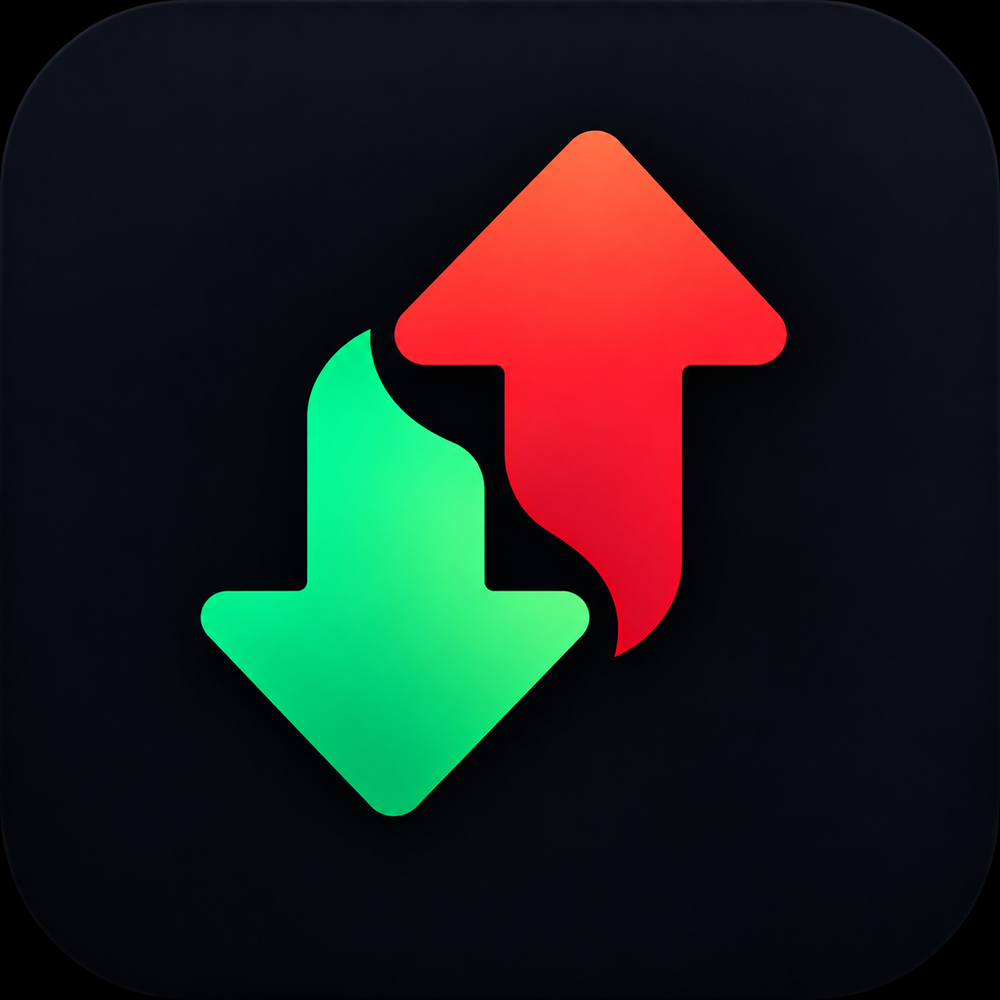

# downuptiles



A compact, mobile-first crypto watchlist and world-market dashboard. React + TypeScript + Vite, with an English UI.
The application uses **real Binance Spot and MEXC Spot market data**.
No API keys, exchange account or trading permissions are required. Binance connects directly;
MEXC uses the included public-data proxy because its REST API does not allow browser CORS.

## Run

Node.js 22.12+ and npm are required (tested with Node.js 22.23.2).

```sh
npm ci
npm run dev
```

Open http://localhost:5173. On a phone connected to the same local network, use
`http://<computer-IP>:5173`. Lists are stored separately for each browser and origin.

```sh
npm run typecheck
npm test
npm run build
npm run preview
```

The production build is in `dist/`. Run `npm start` after building to serve it with the MEXC
and world-market endpoints (default port 5173; override with `PORT`). Development and preview include both.
A static-only deployment must route `/api/mexc/*` and `/api/world/*` to this server. No private credentials are used.

## Crypto / Market

The header offers **Crypto / Tops / Market**: saved crypto watchlists, Top movers, and ten fixed Market tiles:
gold, silver, S&P 500, Nasdaq-100, Brent futures, USD/EUR, USD/RUB, USD/UZS, USD/CNY and USD/KZT.
Uzbek som is UZS; Kazakh tenge is KZT. Navigation and reload preserve the selected mode.

- All ten instruments use Yahoo Finance: gold (`GC=F`), silver (`SI=F`), Brent (`BZ=F`),
  S&P 500 (`^GSPC`), Nasdaq-100 (`^NDX`) and currencies (`EUR=X`, `RUB=X`, `UZS=X`, `CNY=X`, `KZT=X`).
- Gold, silver and oil are **futures**, not physical spot quotes. Metals use USD per troy ounce;
  Brent uses USD per barrel. Indices are quoted in points; currencies are units per one USD.
- All detail charts offer 15m, 1h and daily candles from Yahoo. Percent change uses the previous
  session close, not the start of the displayed history. Currency updates can be infrequent.
- Prices may be delayed. Yahoo's public chart endpoint is unofficial and may change or rate-limit
  requests. No Gold API or CBU requests remain; the old mixed-source local quote cache is ignored.
- Every detail view shows the source, quote date and data limitations. Refresh runs every minute;
  cached values remain gray while updating or offline. First-load failures show `No data` with retry.
- The fixed-symbol `/api/world/quote` endpoint shares cached upstream responses and identical pending
  requests across visitors. Upstream concurrency is four, the waiting queue is capped at forty,
  and each upstream request times out after ten seconds. Client timeout is thirty seconds.
  Successful upstream responses are cached for one minute.

## Market data

- Sources: **Binance Spot and MEXC Spot**, USDT pairs only. Availability depends on region/network and exchange listings.
- REST: `https://data-api.binance.vision/api/v3`.
- WebSocket: `wss://data-stream.binance.vision/stream`.
- Market discovery: cached `exchangeInfo`, active spot pairs only. The picker shows 20 matches at a time, with exchange filters and Show 20 more.
- Initial quotes: batched `ticker/24hr`, at most 20 symbols per request.
- Sparklines: 15-minute candle closes for the last 24 hours, with the ticker's rolling 24h opening
  price at the start and current price at the end. The percent uses the same ticker baseline.
- Live watchlist: one combined WebSocket for visible instruments, with ticker and 15m candle streams.
- Candle chart: real OHLCV history plus a candle WebSocket for the selected interval.
- History loading is limited to four concurrent sparkline requests. REST sparkline history is cached
  for one minute; incoming candles update that cache.
- On quote stream failure, polling refreshes the batch every 5 seconds. Failures increase the delay;
  HTTP 429/418 respect `Retry-After`. A live reconnect is attempted after 60 seconds.
- Silent quote streams fall back after 30 seconds. Silent chart streams fall back after 20 seconds,
  with chart polling every 15 seconds. Offline/background tabs pause subscriptions.
- Unsupported pairs show an explicit message. **Real data is never replaced with mock prices.**

### MEXC

- Exchange IDs such as `mexc:MX` preserve the exact market through reload and layout export/import.
- Quotes poll every 5 seconds, with at most four concurrent pair requests; sparklines cache for 60 seconds.
- The candle chart polls every 15 seconds. Hourly and weekly intervals map to MEXC `60m` and `1W`.
- Each exchange has its own connection, error state and local quote cache. A failing exchange does
  not stop or gray out healthy quotes from the other exchange.
- `/api/mexc/` proxies only GET requests to `exchangeInfo`, `ticker/24hr` and `klines` on the fixed
  official host. Upstream requests time out after 10 seconds (client timeout: 12 seconds).
- The proxy caches catalog responses for one hour, other successful responses for three seconds,
  and coalesces simultaneous identical requests. It forwards rate-limit status and Retry-After.
- Search failures are reported per exchange, with results from the available exchange retained.

Reference: [MEXC Spot API](https://mexcdevelop.github.io/apidocs/spot_v3_en/).

### GRAM

The user confirmed that GRAM means the native TON coin, formerly Toncoin, not a separate
TON-based token sharing the ticker. The existing `gram` asset ID explicitly maps to Binance
`GRAMUSDT`, verified against the exchange announcement and `exchangeInfo`.
Its display name is “Gram (formerly Toncoin)”; searching for Toncoin also finds GRAM.
Legacy `ton` entries are not silently remapped: if TONUSDT is unavailable, the tile explains
that Toncoin now trades as GRAM in the error tooltip.

Reference: [Binance Toncoin → Gram announcement](https://www.binance.com/en/square/post/340336090265410).

Official API references:
[public market-data hosts](https://github.com/binance/binance-spot-api-docs/blob/master/faqs/market_data_only.md),
[REST](https://github.com/binance/binance-spot-api-docs/blob/master/rest-api.md),
[WebSocket streams](https://github.com/binance/binance-spot-api-docs/blob/master/web-socket-streams.md).

## UI and storage

Last known quotes and sparklines are cached locally (up to 100 assets per provider).
Reloading restores them in gray with `Stale data` until each asset receives a fresh quote.
Failed first loads show `No data`. Cache writes are throttled to once per five seconds,
with a final save when the page is hidden or left. Unavailable browser storage does not
prevent live updates. Quote caches are separate from layout exports.

- Tap **Tops** (or the logo) for **Top movers**: up to five gainers and five losers across all tabs.
  Repeated exchange pairs are deduplicated; the same symbol on different exchanges remains separate.
  Only quotes from a healthy connection, without errors and no older than 60 seconds, qualify.
  Displayed zero changes are excluded. Rankings update automatically; tap a tile for its chart.
  Back returns through Top movers to the previously selected watchlist.
- Top movers includes **My pairs / Binance / MEXC** tabs. Market tabs select the 100 active
  USDT pairs with the largest 24-hour quote volume on that exchange, then show up to ten
  gainers and ten losers within that set. Only tickers updated within the last two minutes
  qualify. Zero changes are omitted, so either list can contain fewer than ten pairs.
- Market rankings refresh every minute. One bulk ticker request selects leaders; only their
  (at most twenty) 15-minute sparklines are fetched, four at a time. Prices and percentages
  remain from the same ranking snapshot. No watchlist additions occur automatically.
- Switching tabs stops the previous ranking's requests. Offline/failed refreshes retain the
  last ranking in gray with a warning. Market-tab selection survives chart navigation and reload.
  The MEXC proxy caches the bulk ticker response for 30 seconds across visitors.
- Two compact columns on phones; four on wide screens.
- Initial Main tab: BTC, ETH, SOL, LTC, GRAM, TRX, BNB, XRP, in that order.
- Price, daily sparkline and rolling 24h percentage. Green for gains, red for losses, yellow for
  changes rounding to zero. Values and colors use the same displayed percentage.
- Movement dots: magnitude strictly greater than 15% / 30% / 50% gives one / two / three dots;
  green for positive changes, red for negative changes.
- Tap a tile for candlesticks, volume, crosshair, pan and zoom. Intervals: 1m/5m/15m/30m/1h/4h/1d/1w.
  Chart timestamps use UTC. Older history loads when scrolling left, up to approximately 5000 candles.
- The chart library is loaded only when opening the chart.
- Up to 5 tabs with 20 assets each. The top `+` opens tab creation and management.
- Swipe on tiles or empty space to switch tabs. Vertical scrolling stays available.
- Hold a tile or tap the pencil to reorder, remove or move assets. Drag handles support touch/mouse;
  keyboard users can focus the handle, press Space, move with arrows and press Space to drop.
- Asset search adds immediately; **Done** closes the picker. Browser Back dismisses an open dialog first.
- Settings include About, **Export layout**, **Import layout**, and **Reset to defaults**.
- Export downloads a versioned `downuptiles-layout-<timestamp>.json` file with tab IDs/names/order,
  asset IDs/order and the active tab. It contains no quotes, account data or network credentials.
- Import validates the file (maximum 256 KB), previews its tabs, and asks before replacing all lists.
  Invalid files, duplicate IDs/assets, unsupported versions and limits over 5 tabs/20 assets are rejected.
  Empty tabs are preserved. Import on another device to transfer the layout; prices load from the provider.
- Reset to defaults also requires confirmation before replacing all lists.
- LocalStorage key: `cryptotiles.workspace`; schema `version: 1`, `initialized: true`.
  Empty lists are preserved. Corrupt or newer-version data is not silently overwritten.
  An explicitly confirmed reset can replace it. Storage failures are shown in the UI.
- Lists are not synchronized between devices or multiple browser windows.

## Architecture

```text
src/
  components/       Tiles, SVG sparklines, dialogs, search, settings, tab management
  pages/            Lazy-loaded candlestick chart
  hooks/            Market subscriptions, workspace persistence, dialog history
  services/         MarketStore, stream/polling lifecycle, formatting
  providers/        Binance/MEXC providers, registry, metadata and mock provider
  storage/          Workspace operations and saved-data validation
  types/            Market and workspace contracts
  App.tsx           Layout, navigation and gestures
  styles.css        Mobile-first styling, no heavy UI framework
```

UI → hooks → MarketStore → MarketDataProvider. Providers own all market requests and exchange
response parsing. React tiles never start their own network loops. Each tile subscribes to its own
quote through `useSyncExternalStore`; an update does not rerender the entire grid.

Array order determines tab/asset order, without duplicated `position` fields. Existing asset IDs
are preserved. Additional Binance instruments use exchange-scoped IDs such as `binance:XYZ`.
The provider validates those IDs against active exchange markets before requesting prices.
The same symbol from different exchanges can share a tab. The same exchange pair cannot be added twice.
The last tab cannot be deleted; its asset list can be empty.

`src/types/market.ts` defines the provider contract:

- `name`, `isDemo`: source identification.
- `getAsset(id)`, `searchAssets(query, signal?)`: metadata and discovery.
- `getQuote(id, signal?)`, `getQuotes(ids, signal?)`: single and batched quotes.
- `getHistory(id, { interval, limit?, before?, signal? })`: OHLCV candles, with Unix seconds timestamps.
- `subscribeQuotes(ids, onQuotes, onError)`: optional live quotes, returning an unsubscribe function.
- `subscribeHistory(id, interval, onCandle, onError)`: optional candle stream.

Batch results can contain per-asset errors, so one unavailable pair does not break the whole list.
Successful quotes carry price, 24h change/high/low, update time and sparkline points.

## Tests and demo mode

```sh
npm test              # Deterministic unit tests, including response validation and fallback
npm run test:e2e      # UI/touch tests against an isolated mock server on port 5174
npm run test:live     # Real REST + WebSocket browser smoke test against port 5173
```

Playwright uses `/usr/bin/google-chrome`; override with `CHROME_PATH` if needed. Browser tests start
or reuse their server. Live tests depend on network access and both exchanges’ availability. Screenshots and
failure traces go to `test-results/`.

For a deliberate offline-development demo:

```sh
npm run dev -- --mode test --port 5174
```

`.env.test` selects `VITE_MARKET_PROVIDER=mock`. The default development/production mode selects
Binance and MEXC. There is no automatic switch to demo data when an exchange is unavailable.
Mock prices and all chart intervals derive from one deterministic function of time.

## Remaining platform work

PWA/service worker, offline cold start, Capacitor, Android/iOS projects and app-store packaging are
not implemented yet. The current milestone is the mobile web app. Physical Android/iPhone testing
is still needed; Chromium touch emulation does not replace it. No accounts, orders, wallets,
alerts, portfolio or cloud sync are included. Server components provide public MEXC and world-market data.

The conversation refinements supersede the original `task.md`: daily sparklines, signed movement
dots, candlestick intervals, compact English UI, and now real market data.

## Chart attribution

[TradingView Lightweight Charts™](https://www.tradingview.com/) is distributed under Apache-2.0.
TradingView attribution is retained on the chart and in its footer.

## Coin icons

The picker loads local PNG icons lazily, including coins that are not in a watchlist.
The base 483-icon [Cryptocurrency Icons](https://github.com/spothq/cryptocurrency-icons) set is CC0;
its license is in `public/coins/LICENSE.md`. Coins without a matching icon retain a colored
letter avatar. No external image requests or broken-image placeholders are required.

Additional TON/GRAM, NEAR, SUI, APT, OP, ARB, SHIB and PEPE logos come from
[Trust Wallet Assets](https://github.com/trustwallet/assets); its license is in
`public/coins/TRUST-WALLET-LICENSE`. GRAM uses the TON logo for the confirmed native coin.

The app was previously named CryptoTiles. Internal storage keys and the JSON backup format
retain their original identifiers so existing layouts, cached quotes and exported files remain compatible.
